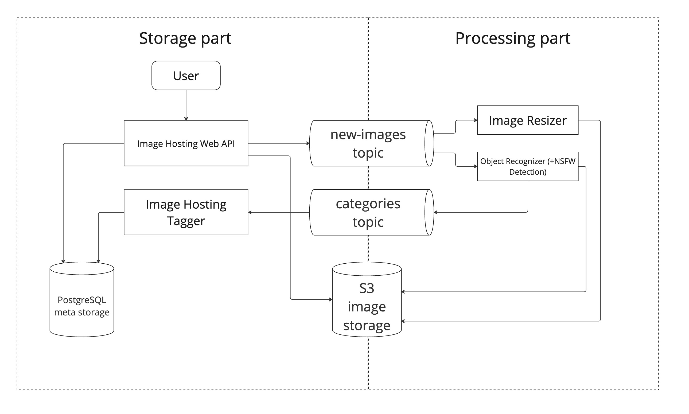
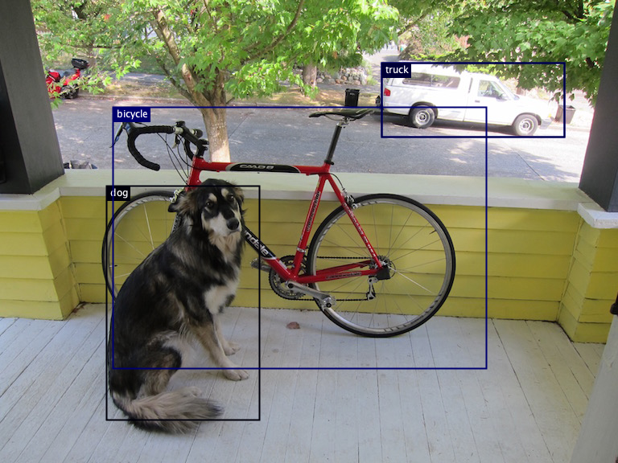

# Image Hosting Processing

Processing part of Image hosting, see storage part here: https://github.com/Baklanov-Soft/image-hosting-storage



Image Hosting is separated into two main parts and multiple microservices communicating via Kafka and shared S3:

- storage (https://github.com/Baklanov-Soft/image-hosting-storage):
    - web API - user API for pictures uploading and managing;
    - tagger - preloader for processing output of recognizer;
- processing (this repo):
    - resizer - creates small previews for uploaded images;
    - recognizer:
        - does automatic object recognition for generating image tags;
        - optional nsfw detection (will add nsfw tag to standard response).

Processing part is stateless and fully scalable via Kafka consumer groups.
See docker-compose for whole project setup with processing cluster.

## Resizer

Resizer service for generating the previews. Compose file contains 2 instances by default (=partitions amount of
new images topic).

Environment variables:

```
KAFKA_BOOTSTRAP_SERVERS - kafka cluster url
CONSUMER_GROUP_ID - consumer id, multiple instances with same id will allow horizontal scaling (depends on topic paritions) 
NEW_IMAGES_TOPIC - topic for notifications about new images
MINIO_HOST - minio from where it will take pictures and where it is going to upload the previews
MINIO_USER
MINIO_PASSWORD
```

### Protocol

Resizer reads `{NEW_IMAGES_TOPIC}` Kafka topic and accepts messages in following format (v1):

```json
{
  "bucket": "00000000-0000-0000-0000-000000000000",
  "prefix": "557b036f-c61f-40b6-ba13-4708519a566f",
  "image": "original.jpg"
}
```

It creates multiple preview images inside the same Minio as it reads from.

## Recognizer

Service for object detection and nsfw content detection.

NSFW detection based on model: https://huggingface.co/Falconsai/nsfw_image_detection
Currently NSFW detection only works on porn images. It doesn't recognize blood or any other stuff.

Converted to DJL TorchScript model (required for service to
work, you will need to mount it to docker (see docker-compose for
reference)): https://huggingface.co/DenisNovac/nsfw_image_detection/tree/main

Environment variables:

```
KAFKA_BOOTSTRAP_SERVERS - kafka cluster url
CONSUMER_GROUP_ID - consumer id, multiple instances with same id will allow horizontal scaling (depends on topic paritions) 
NEW_IMAGES_TOPIC - topic for notifications about new images 
CATEGORIES_TOPIC - topic for output of service 
DEBUG_CATEGORIES - write debug object detection pictures (draw squares around detected objects) into S3
NSFW_SYNSET_PATH - synset.txt file for nsfw detector (list of categories, included in project)
NSFW_MODEL_PATH - pre-trained model for nsfw detection, requires one specific model, others could be working wrong
ENABLE_NSFW_DETECTION - allows to disable nsfw detection completely (and skip it's init)
MINIO_HOST - minio from where it will take (and save debug) pictures
MINIO_USER
MINIO_PASSWORD
```

**NOTE:** nsfw model and synset must be in subfolder such as /nsfw (see docker-compose for reference)

**NOTE 2:** debug images are heavy png (and might be much heavier than original image)

### Protocol

Recognizer reads `{NEW_IMAGES_TOPIC}` Kafka topic and accepts messages in following format (v1):

```json
{
  "bucket": "00000000-0000-0000-0000-000000000000",
  "prefix": "557b036f-c61f-40b6-ba13-4708519a566f",
  "image": "original.jpg"
}
```

Recognizer writes output to `{CATEGORIES_TOPIC}` Kafka topic in following format (v1):

```json
{
  "image": {
    "bucket": "00000000-0000-0000-0000-000000000000",
    "prefix": "d082dd66-5723-4ca3-8401-f78410ecf32e",
    "name": "original.jpg"
  },
  "categories": {
    "nsfw": 0.9998799562454224,
    "person": 0.9533286094665527
  }
}
```

It might write the debug picture into the debug folder of minio if `{DEBUG_CATEGORIES}` flag is true such as:


